# HarleyDroid EVO

Harley-Davidson J1850 / CAN data analyser for Android — evolution of the
original open-source [HarleyDroid](https://github.com/stelian42/HarleyDroid).
The **EVO** name marks this modern continuation and nods to Harley-Davidson’s
Evolution (EVO) engine.

<p align="center">
  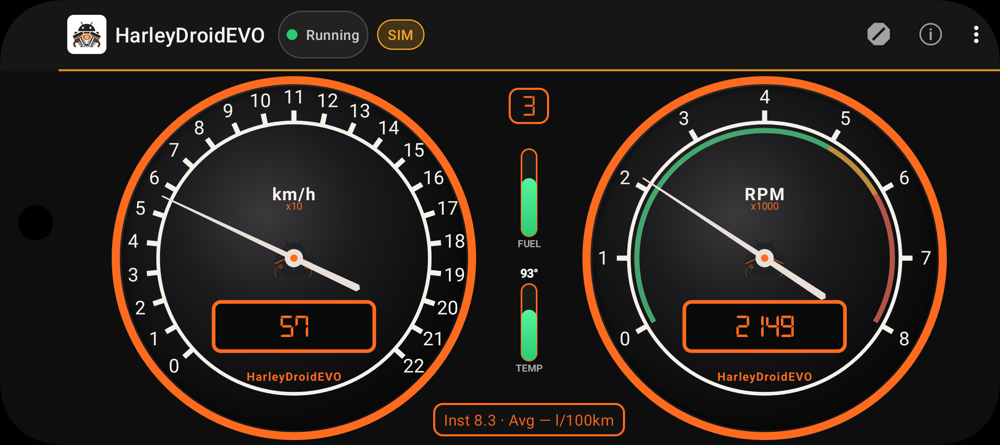
</p>

**Version:** 3.2-EVO · targetSdk / compileSdk 35 · minSdk 21  
**APK downloads:** [GitHub Releases](https://github.com/QuickosssLabs/HarleyDroidEVO/releases)  
**Build notes:** [BUILD.md](BUILD.md) · **Release notes:** [RELEASE_NOTES.md](RELEASE_NOTES.md)

---

## Copyright and licence

Copyright (C) 2010–2012 Stelian Pop \<stelian@popies.net\> — original HarleyDroid  

Copyright (C) 2026 Quickosss — HarleyDroid EVO (maintenance, Android modernization,
Material UI, dual-bus J1850/CAN, documentation)

Free software under the **GNU GPL v3 or later** (see [COPYING](COPYING)).
Quickosss continues the project under the same GPL while preserving Stelian Pop’s
authorship and protocol work.

---

## Introduction

This Android app captures, decodes and analyses the data bus stream of a
Harley-Davidson bike — historically SAE J1850 (4-pin port), and with
HarleyDroid EVO also passive HDLAN / CAN (6-pin port).

Decoded information (RPM, speed, odometer, fuel, temperature, etc.) is shown on
screen and can be logged for later use.

---

## Screenshots

### Graphical dashboard

| Portrait | Landscape |
|:--------:|:---------:|
| 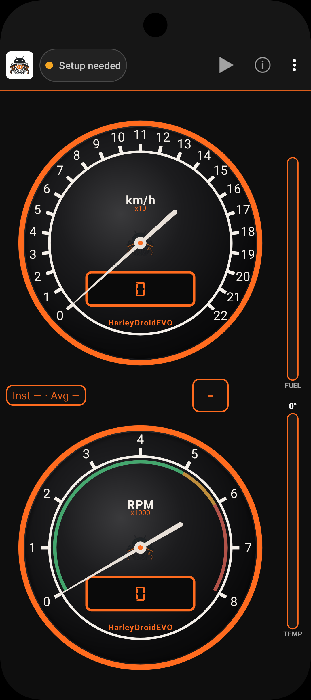 | 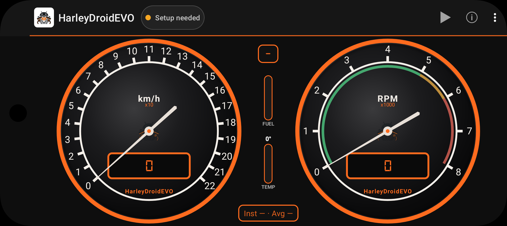 |

Twin dials (speed + RPM) with digital LCD readouts, vertical **FUEL** / **TEMP**
bar gauges, gear chip, economy strip, and connection status pill.

### Simulation & cluster self-test

| Live simulation | Power-on sweep |
|:---------------:|:--------------:|
|  | 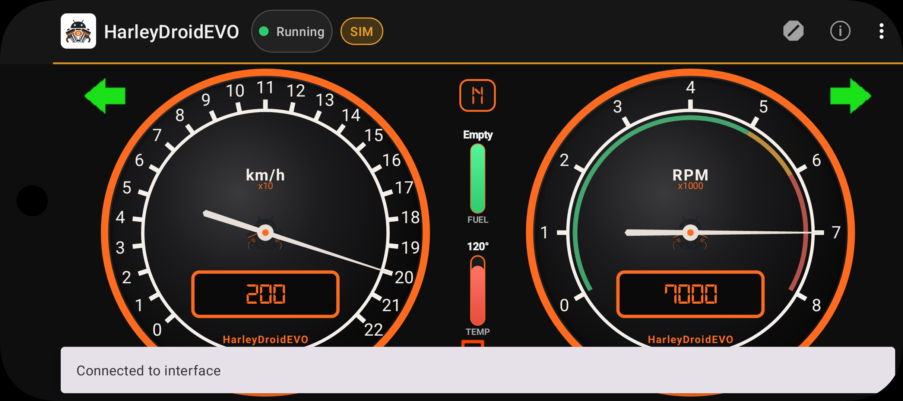 |

Fake J1850/CAN stream without bike or Bluetooth (**SIM** badge). On connect, a
Harley-style bulb-check sweeps the needles and lamps.

### Text / digital dashboard

| Portrait | Landscape | Simulation |
|:--------:|:---------:|:----------:|
| 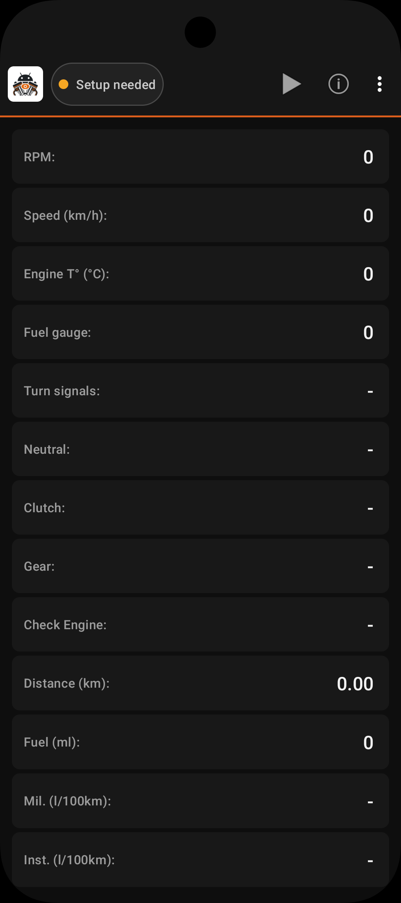 | 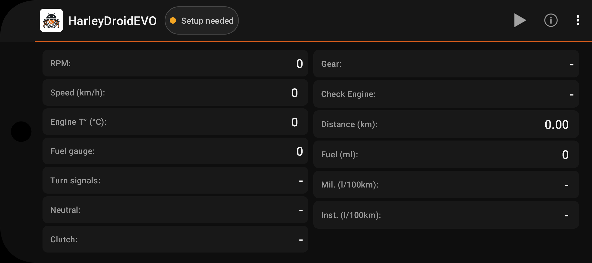 | 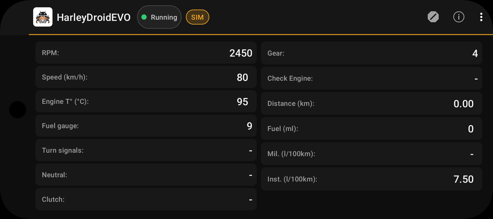 |

Metric cards for RPM, speed, temp, fuel, gear, trip, economy, switches, etc.

### Diagnostics

| Portrait | Landscape | Clear historic DTCs |
|:--------:|:---------:|:-------------------:|
| 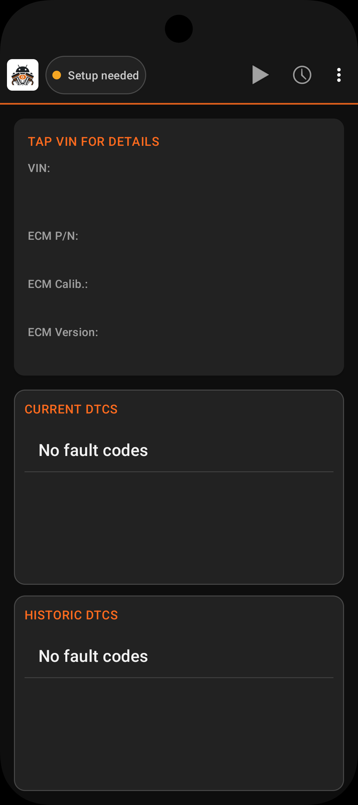 | 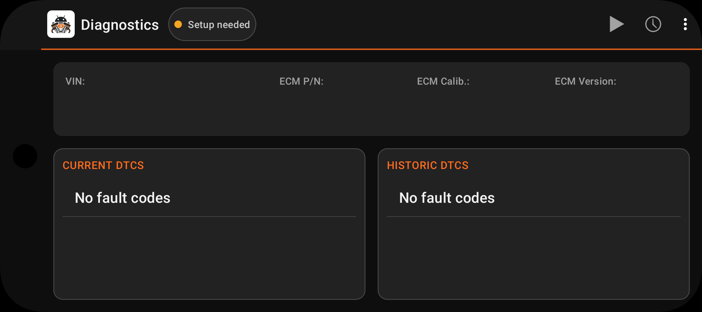 | 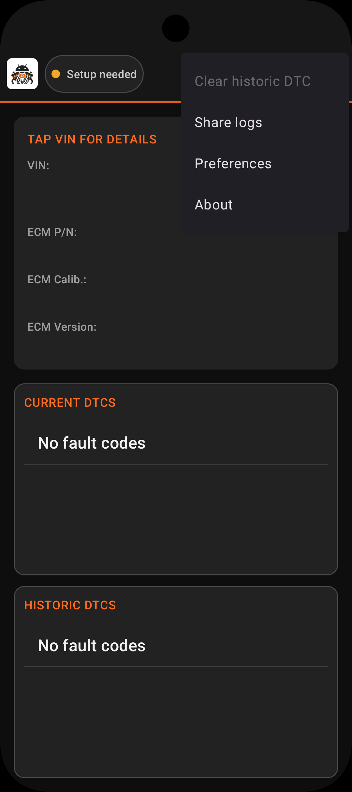 |

VIN / ECM info and **DTCs by module** (ECM / ABS / TSM) on J1850. Selective
clear via dialog. Tap a code for its description. Tap VIN for decoded details.

### Settings, about & licence

| Settings | Themes / units | About | Licence |
|:--------:|:--------------:|:-----:|:-------:|
| 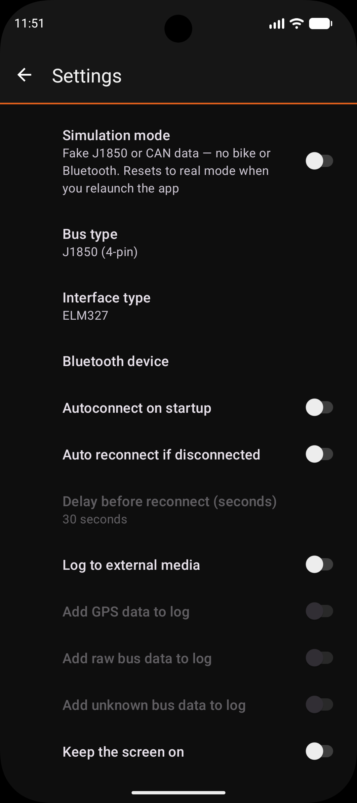 | 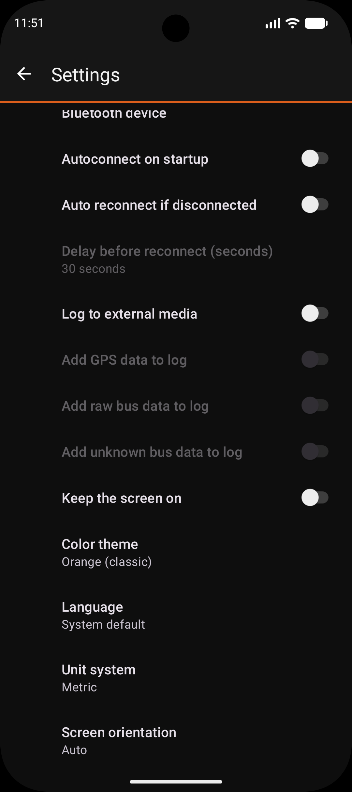 | 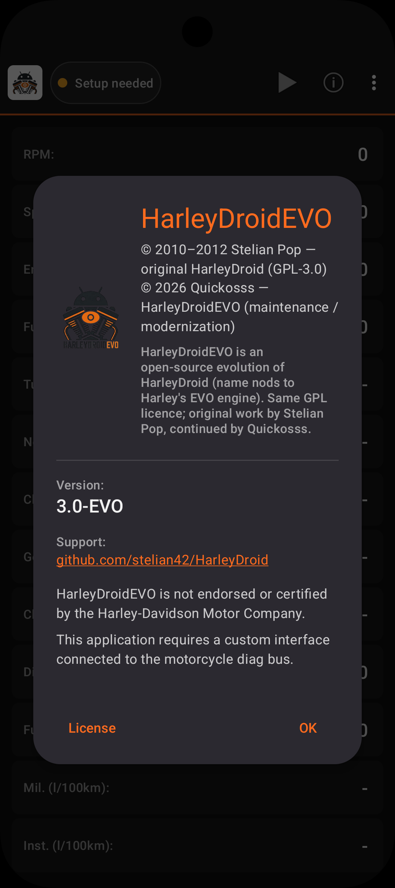 | 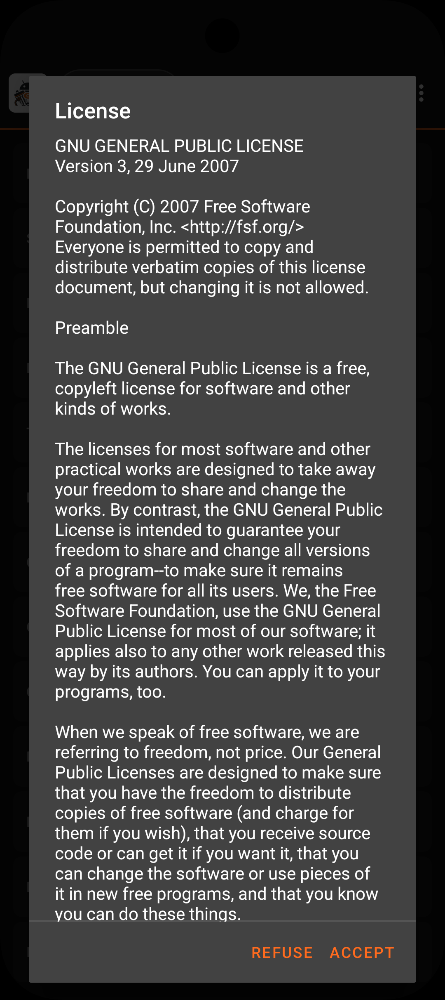 |

---

## What’s new in HarleyDroid EVO

### 3.2 — Logs, live graph, module DTCs

- **View logs** — browse `.log.gz`, share / delete, open a replay chart
- Replay: up to two metrics (RPM, SPD, ETP, GER, ODO, FUL, FGE) with time scrub
- **Live graph** — ~60 s sliding window while connected (same metric chips)
- Diagnostics: DTCs per **ECM / ABS / TSM**; selective clear; richer DTC dictionary
- Session summary on replay (max RPM / SPD / ETP, trip from ODO)

### Android platform

- Builds for modern Android (compileSdk / targetSdk 35, JDK 17)
- Runs from Android 5.0 (API 21) upward
- Runtime permissions: Bluetooth at connect time; location only if GPS logging is enabled
- FileProvider export / share of compressed logs (`.log.gz`)
- Foreground notification with live RPM / speed

### UI modernization (Material 3)

- Dark Material 3 theme (toolbar, status pills, section cards, dialogs)
- New branding: launcher / notification icons + full logo in About
- Selectable **color themes** (Orange, Amber, Crimson, Teal, Blue, Green, Silver)
- Language preference (system / English / Français)
- Connection status pill + **SIM** badge when simulation is active
- Redesigned diagnostics cards and settings (`PreferenceFragmentCompat`)

### Gauges & cluster

- Modernized circular gauges: rim accent, LCD digital frame, logo mark, RPM color bands
- New vertical **MiniBarGauge** bars for fuel and engine temperature
- Center gear chip, turn-signal arrows, economy Instant / Average strip
- Harley-style **power-on self-test** (needle sweep + warning lamps)
- Text mode with metric rows / chips matching the new visual language

### Options & dual bus

- Preference: bus type — J1850 (4-pin) or CAN / HDLAN (6-pin)
- Preference: connection — Bluetooth SPP or WiFi TCP (ELM327)
- Preference: simulation mode (fake J1850 or CAN data, no bike / adapter)
- Preference: interface ELM327 or HDI (HDI is Bluetooth + J1850-only; CAN / WiFi force ELM327)
- Autoconnect, autoreconnect, units, orientation, keep-screen-on, etc.
- FR / EN strings for the new options

### Dual bus (J1850 + CAN)

- Same app and dashboard for both connector generations
- **J1850** — full path: dashboard `ATMA` + active diagnostics (VIN / ECM / DTC read & clear)
- **CAN V1** — passive dashboard telemetry only (see [CAN section](#harley-can--hdlan-protocol-evo-v1))
- Active DTC / VIN over CAN are **not** implemented until validated request/response
  captures exist (no guessed protocol)
- VIN decoder dialog when a VIN is available (J1850)

---

## Hardware requirements

### Common

- an ELM327 module (genuine or clone), via **Bluetooth SPP** or **WiFi TCP**
  (typical port **35000**). For CAN / HDLAN you need a module that actually
  speaks ISO 15765-4 CAN at 500 kbit/s (many cheap “ELM327” clones are
  J1850-only — verify before buying)

### Connection (Preferences)

1. Disable **Simulation mode**
2. Choose **Connection**: Bluetooth or WiFi (TCP)
3. **Bluetooth**: pick the paired ELM327 / HDI device  
   **WiFi**: set host IP (often `192.168.0.10`) and port (`35000`), join the
   dongle’s WiFi AP first
4. Interface type: ELM327 (required for WiFi / CAN) or HarleyDroidInterface
   (Bluetooth + J1850 only)

### J1850 — 4-pin Deutsch (classic bikes)

Custom cable from the bike’s 4-pin data/diagnostic port (near the battery on
many Sportsters) to the ELM327’s 16-pin J1979 connector:

```
Harley data port          16 pin J1979 connector (ELM327)
---------------------------------------------------------
(x)     1
(brown) 2 ------------- ground -------  4 and 5 (ground)
(green) 3 ------------- data ----------  2       (J1850+)
(white) 4 ------------- +12V ---------- 16       (+12V)
```

Optional: HDI interface (J1850 only).

### CAN / HDLAN — 6-pin Deutsch (newer bikes)

- Deutsch 6-pin diagnostic port + cable to an ELM327 with CAN support
- In Preferences → Bus type, select “CAN / HDLAN (6-pin)”
- App configures ELM327 with `ATSP6`, `CAF0`, `ATMA` (passive monitor)
- Byte layouts vary by model/year — calibrate with raw logs if needed

Pinouts differ by year/model; use a known-good Harley CAN cable or community
pinout for your bike. Do not assume the 4-pin wiring above.

---

## Harley J1850 protocol

### Disclaimer

All of the following was found by trial and error on Harley-Davidson bikes
(notably Sportster) using an ELM327 in SAE J1850 VPW mode. No official
Harley-Davidson documentation was used. Frame IDs and scaling may differ by
model/year. Contributions and corrections are welcome.

### Physical / transport (as used by HarleyDroid EVO)

- Bus: SAE J1850 VPW (~10.4 kbaud), selected on ELM327 with `ATSP2`
- The app listens with `ATMA` (monitor all) for the dashboard stream
- Diagnostics use addressed commands (`ATSH` + payload), not only broadcast
- Frames are shown as hex bytes; the last byte is a CRC
- A frame is accepted only if `CRC(frame) == 0xC4`
  (see `J1850.crc()` / `J1850.parse()`)

Informal frame layout (decoded messages):

```
[ hdr0 hdr1 hdr2 hdr3 ] [ data ... ] [ CRC ]
```

The first four bytes are often treated as a 32-bit message id (big-endian).
Data length varies (1–2+ bytes typical for gauges; longer for VIN/ECM/DTC).

### Dashboard / broadcast messages (poll / ATMA)

```
28 1b 10 02 xx xx
    RPM.  xxxx (big-endian uint16) = RPM * 4
    App display: RPM = xxxx / 4

48 29 10 02 xx xx
    Road speed.  xxxx = km/h * 128
    App: metric km/h = xxxx / 128
         imperial mph ≈ (xxxx * 125) / (16 * 1609)

48 3b 40 xx
    Neutral / clutch status (byte xx):
      neutral false if xx == 0x20
      neutral true  if xx == 0xA0
      clutch engaged if (xx & 0x80) != 0

48 da 40 39 xx
    Turn signals.  Low 2 bits of xx:
      0x01 = right, 0x02 = left, 0x03 = both / hazard
    Log codes: R / L / W

68 88 10 03 / 68 88 10 83
    Check-engine lamp.  Bit 0x80 of the 4th header/data nibble:
    off when clear, on when set (functionally: 0x03 off, 0x83 on).

a8 3b 10 03 xx
    Current gear.  xx is a bit field; app counts right-shifts until zero
    → gear 1–6 (0 → unknown/-1)

a8 49 10 10 xx
    Engine temperature.  Raw xx stored as (Celsius + 40):
      °C = xx - 40
      °F = (xx - 40) * 9/5 + 32

a8 69 10 06 xx xx
a8 69 10 86 xx xx
    Odometer pulse counter.  xxxx = ticks; 1 tick = 0.4 m
    Bit 0x80 marks wrap / alternate form; app accumulates deltas.

a8 83 10 0a xx xx
a8 83 10 8a xx xx
    Fuel-used pulse counter.  xxxx = ticks; 1 tick = 0.000040 L.
    App converts to ml / imperial volume and derives economy.

a8 83 61 12 dx
    Fuel gauge.  Low nibble of data = level 0–15
    Bit 0x80 → low-fuel warning
```

Many other broadcast ids appear on the bus and are logged as `UNK` when
“log unknown” is enabled.

### Diagnostics (request / response)

The Diagnostics screen actively queries the ECM (not only passive `ATMA`).
Typical pattern:

```
Request (example family):  0C 10 F1 3C  <block>
Reply family:              0C F1 10 7C  <block> <payload…>
```

Read-info blocks (reply `0C F1 10 7C`, sub-id in next byte):

| Block | Content |
|------:|---------|
| 01 / 02 | ECM part number (two 6-byte chunks → 12 chars) |
| 03 / 04 | ECM calibration ID (two 6-byte chunks) |
| 0B | ECM software level (1 byte) |
| 0F / 10 / 11 | VIN (6 + 6 + 5 ASCII → 17) |

DTC (ISO-style P/C/B/U codes packed in two data bytes):

```
Request family:  6C .. F1 19 …   (get DTC)
Reply family:    6C F1 .. 59  aa bb
Clear family:    6C .. F1 14 …
Clear reply:     6C F1 .. 54 …
```

Exact TA/SA used by the app live in `HarleyDroidDiagnostics`
(ECM `10` / ABS `40` / TSM `60`). DTCs are stored and shown **per module**;
clear can target a subset of modules.

Implementation: `app/src/main/java/org/harleydroid/J1850.kt`

---

## Harley CAN / HDLAN protocol (EVO V1)

### What works today vs what does not

| Feature | J1850 (4-pin) | CAN / HDLAN (6-pin) |
|---------|---------------|---------------------|
| Live dashboard (speed, temp, …) | Yes | Yes (passive / best-effort) |
| Simulation | Yes | Yes |
| Log / replay / live graph | Yes | Yes (from decoded metrics) |
| Read VIN / ECM info | Yes | **No** (V1) |
| Read / clear DTCs | Yes (ECM / ABS / TSM) | **No** (V1) |

Active CAN diagnostics need reverse-engineered **request/response** frames
(addressed UDS-style or Harley-specific), which vary by model and year. The
project will not invent those commands: a wrong clear or query is worse than
an honest “unsupported” banner.

If you only have a 4-pin bike (or no CAN hardware), focus on J1850 — that is
the fully supported diagnostic path. Keep bus type on **J1850**, use
simulation for UI demos, and treat CAN as optional telemetry.

### Disclaimer

CAN decoding uses community / RealDash-style 11-bit ID maps. No official
Harley-Davidson documentation was used. IDs and byte layouts may differ by
model and year. Prefer raw logging + unit tests when calibrating.

### Physical / transport

- Bus: Harley HDLAN-style CAN (~500 kbit/s, 11-bit IDs)
- ELM327: `ATSP6`, `CAF0` (raw frames), `ATMA` (monitor all)
- Passive listen only in V1 — no active DTC / VIN over CAN yet
- Diagnostics screen reports that CAN active diag is unsupported

### Community IDs decoded by HarleyCan (best-effort)

```
0x521  speed (km/h in payload; app stores ×128 like J1850)
0x5C0  odometer (absolute km → display units)
0x541  engine temperature (°C → offset +40 in-app)
0x550  switches (e.g. clutch bit)
0x530  status (e.g. neutral)
0x5C1  engine / RPM (tentative)

Gear: estimated from RPM/speed (Cruise Drive relative ratios),
blanked when neutral, clutch in, or low speed/RPM.
```

ELM line forms accepted: `521 00 64 …`, `521#0064…`, `5210064…` (`ATS0`).

Implementation: `app/src/main/java/org/harleydroid/HarleyCan.kt`  
Tests: `app/src/test/java/org/harleydroid/HarleyCanParseTest.kt`

### ELM327 setup (summary)

```
Common: ATWS, ATE1, ATH1, ATAL, ATS0 (if supported)

J1850:  ATSP2
        Dashboard: ATMA
        Diagnostics: ATSH <type><ta><sa> then command bytes

CAN:    ATSP6, CAF0
        Dashboard: ATMA (passive)
        Diagnostics: not supported in V1
```

### How to contribute CAN (telemetry or future DTC)

**Passive map improvements (any 6-pin owner):**

1. Preferences → bus **CAN / HDLAN**, enable **log raw / unknown**
2. Capture a short ride; note model / year and what the cluster showed
3. Open an issue or PR with the `.log.gz` (or hex excerpts) + proposed ID/scaling
4. Add a unit test beside `HarleyCanParseTest` when possible

**Active diagnostics (DTC / VIN) — only with proof:**

1. Same raw logging while a known tool (or careful ELM session) queries DTCs
2. Pair request hex + response hex + resulting codes on the bike
3. Document address / service / payload; submit fixtures for automated tests
4. Maintainers will wire the same module UI used for J1850 once captures validate

Without those captures, CAN stays **listen-only** on purpose.

---

## HarleyDroid EVO log format

Logs are CSV gzip files (`harley-*.log.gz`). Open them in-app via **View logs**
(dashboard menu) for replay charts, or use **Live graph** while connected.

Logs are CSV:

```
timestamp,type,value,longitude,latitude,altitude,date
```

Timestamp format: `YYYYMMDDhhmmss` (milliseconds may be appended).

Type/value combinations (depending on metric/imperial settings):

| Type | Meaning |
|------|---------|
| `RPM` | rpm |
| `SPD` | speed (mph or km/h) |
| `GER` | gear 1–6 |
| `NTR` | neutral 0/1 |
| `CLU` | clutch 0/1 |
| `TRN` | L / R / W |
| `CHK` | check engine 0/1 |
| `ETP` | engine temperature (°C or °F) |
| `ODO` | trip odometer (miles or km × 100) |
| `FUL` | fuel used (ml or fl oz) |
| `FGE` | fuel gauge 0–6 or EMPTY |
| `VIN` / `EPN` / `ECI` / `ESL` | VIN / ECM PN / calib / SW level |
| `DTC` | DTCs (`DTC,<MODULE>,code,…` — ECM / ABS / TSM) |
| `DTH` | legacy historic DTC lines (older logs) |
| `RAW` | raw bus line (if enabled) |
| `CRC` | bad J1850 message |
| `UNK` | unknown bus message |

---

Original author: Stelian Pop \<stelian@popies.net\>  
HarleyDroid EVO: Quickosss (2026) — Android modernization, Material UI,
dual-bus J1850 (4-pin) + CAN/HDLAN (6-pin), simulation, gauges, log charts,
module DTCs  
Licence: GNU GPL v3 or later ([COPYING](COPYING))
